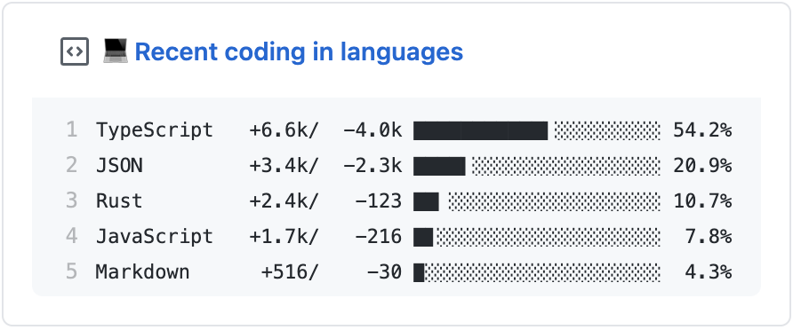

  
  <h3 align="center">lang-box</h3>
  
💻 Update a pinned gist to contain languages of your recent commits in GitHub

---

> This project is inspired by [waka-box](https://github.com/matchai/waka-box), [productive-box](https://github.com/maxam2017/productive-box) and [metrics](https://github.com/lowlighter/metrics). 
> 📌✨ For more pinned-gist projects like this one, check out: https://github.com/matchai/awesome-pinned-gists

This project gets your recent commits from your activities fetched from GitHub API, and process them with [linguist](https://github.com/github/linguist) to show the percentage of each languages used. This project also calculate how many lines of codes were added/removed per language.

## Setup

### Prep work

1. Create a new public GitHub Gist (https://gist.github.com/)
1. Create a token with the `gist` scope and copy it. (https://github.com/settings/tokens/new)

   - And if you would like to include commits in private repos, also add `repo` scope.

     > Enable `repo` scope seems **DANGEROUS**, but secrets are not passed to workflows that are triggered by a pull request from a fork (https://docs.github.com/en/actions/reference/encrypted-secrets)

### Project setup

1. Fork this repo, or [create a repository from template](https://help.github.com/en/github/creating-cloning-and-archiving-repositories/creating-a-repository-from-a-template) by clicking [here](https://github.com/inokawa/lang-box/generate) or the **Use this template** button on this project.
   - If you added `repo` scope above, it's recommended to create private repository.
1. Open the "Actions" tab of your fork and click the "enable" button.
1. Edit the [environment variable](https://github.com/inokawa/lang-box/blob/master/.github/workflows/run.yml#L32-L33) in `.github/workflows/run.yml`:

   - **GIST_ID:** The ID portion from your gist url: `https://gist.github.com/inokawa/`**`64dacee1c6c93cdbcf48548f6598f823`**.

1. Go to the repo **Settings > Secrets**
1. Add the following environment variables:
   - **GH_TOKEN:** The GitHub token generated above.
1. [Pin the newly created Gist](https://help.github.com/en/github/setting-up-and-managing-your-github-profile/pinning-items-to-your-profile)
